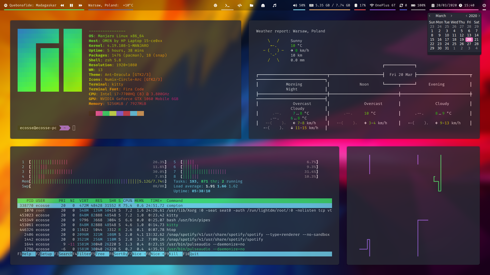
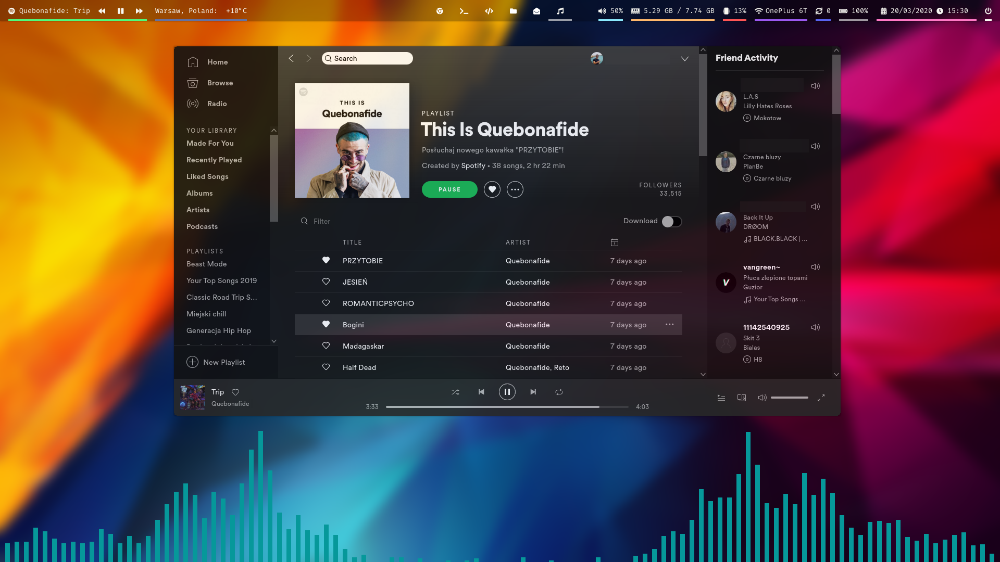
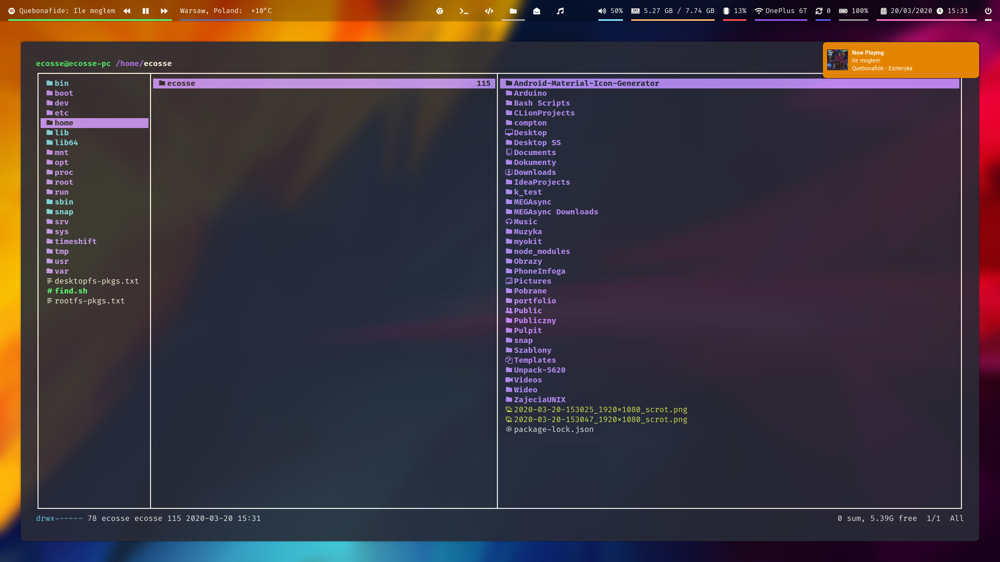
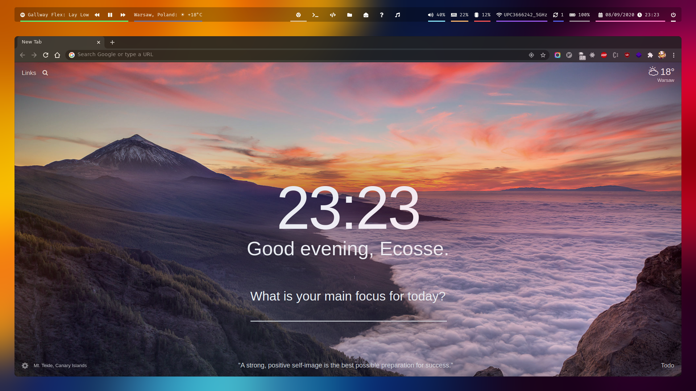
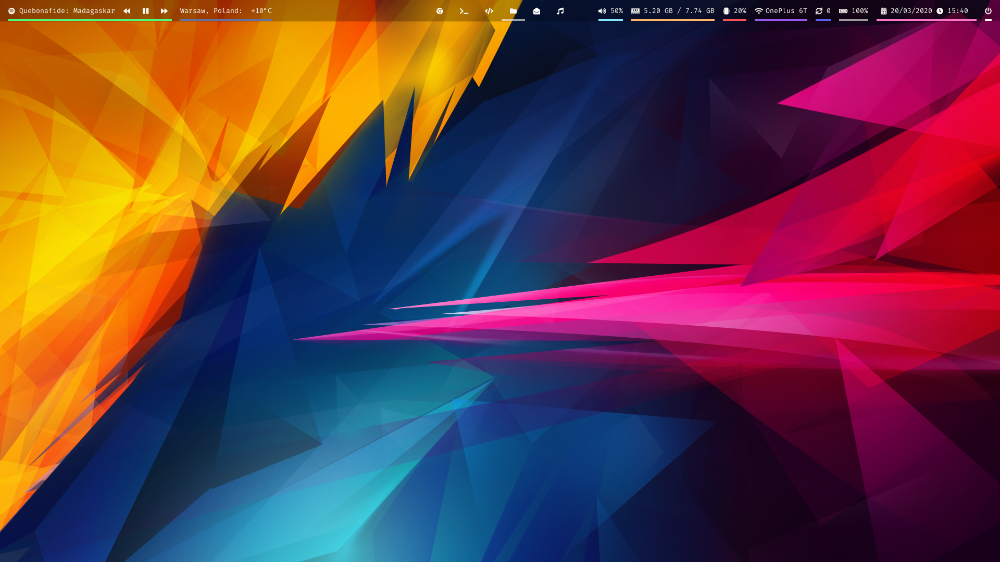
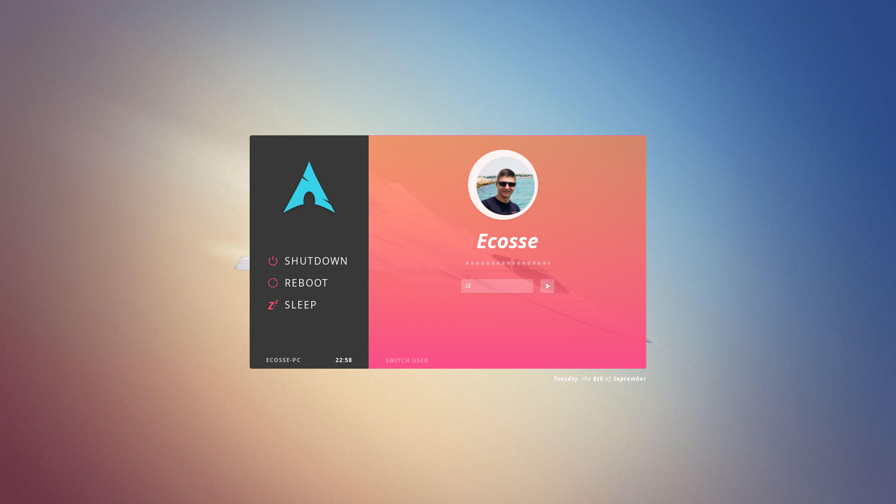
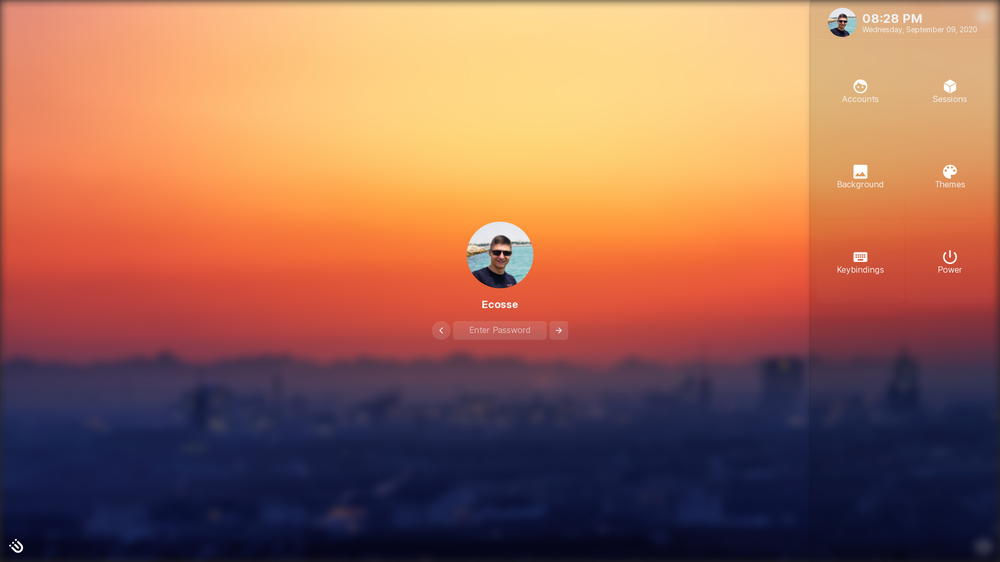

# awesomewm/i3 & neovim dotfiles

[](https://www.repostatus.org/#active)


## Screenshots








## Some details

-   **OS**: Manjaro
-   **WM**: awesome (previously i3)
-   **Shell**: oh-my-zsh
-   **Terminal**: Kitty
-   **File Manager**: Ranger for terminal, Nautilus for GUI
-   **Launcher**: Rofi
-   **Editor**: Neovim :heart: [Repo](https://github.com/ecosse3/nvim)
-   **Browser**: Google Chrome (from snap)
-   **Theme**: Ant-Dracula
-   **Icons**: Numix-Circle-Arc
-   **Terminal Font**: Fira Code Nerd Font
-   **ZSH Theme**: [powerlevel10k](https://github.com/romkatv/powerlevel10)
-   **lightdm Theme**: [Aether](https://github.com/NoiSek/Aether)

## Dependencies

Here is a complete list of dependencies needed for making these themes work.
If you install all of them you will have a (mostly) smooth out of the box experience.
Also if you are willing to edit a few configuration files, **which you will have to do** at some point, most of these dependencies can be replaced. For example you can replace `rofi` with `dmenu`,`maim` with `scrot`.

If you notice that something is missing, please contact me.
Almost all dependencies you can download from `yaourt` or `yay`

| Dependency                                                                         | Description                                                 | Why/Where is it needed?         |
|------------------------------------------------------------------------------------|-------------------------------------------------------------|---------------------------------|
| `i3-gaps`                                                                          | Window manager                                              | (explains itself)               |
| `awesome-git`                                                                      | Window manager                                              | (explains itself)               |
| `polybar`                                                                          | Status bar                                                  | (explains itself)               |
| `rofi`                                                                             | Window switcher, application launcher and dmenu replacement | (explains itself)               |
| `picom`                                                                | X Compositor                                                | Makes transparency to windows   |
| `lm_sensors`                                                                       | CPU temperature sensor                                      | CPU temperature widgets         |
| `pulseaudio`, `libpulse`                                                           | Sound system **(Installed by default on most distros)**     | Volume widgets and keybinds     |
| `mpd`                                                                              | Server-side application for playing music                   | Music widgets                   |
| `mpc`                                                                              | Minimalist command line interface to MPD                    | Music widgets                   |
| `maim`                                                                             | Takes screenshots (improved `scrot`)                        | Screenshot keybinds             |
| [i3lock-fancy-multimonitor](https://github.com/guimeira/i3lock-fancy-multimonitor) | Fancy i3lock                                                | (explains itself)               |
| `scrot`                                                                            | Takes screenshots                                           | We need it for lockscreen       |
| `i3-lock`                                                                          | Locks screen                                                | We need it for lockscreen       |
| `feh`                                                                              | Image viewer and wallpaper setter                           | Screenshot previews, wallpapers |
| `dunst`                                                                            | Notification daemon                                         | (explains itself)               |
| `xautolock`                                                                        | An automatic X screen-locker                                | (explains itself)               |
| `tilda`                                                                            | Terminal emulator needed to run cava                        | (explains itself)               |
| `lightdm`                                                                          | Light display manager of login screen                       | (explains itself)               |

### Fonts

##### Icon fonts

-   **Font Awesome 5**
-   **Inter Regular**
-   **NotoEmoji Nerd**
-   **Faba** (for dunst notifications)

##### Monospace

-   **Fira Code Nerd Font**
-   **DejaVu Sans Mono**

##### Sans

-   **Google Sans**
-   **Roboto Condensed**
-   **Noto Sans**

## Things to do after you set up dependencies

-   Backup your current i3 setup
-   Copy my dotfiles


-   Install i3lock-fancy-multimonitor:

note: currently I'm using [i3lock-fancy](https://github.com/meskarune/i3lock-fancy/tree/dualmonitors) from dualmonitors branch which you have to build on your own. This below still looks and works good.

```
git clone https://github.com/guimeira/i3lock-fancy-multimonitor.git
cp -r i3lock-fancy-multimonitor ~/.scripts
chmod +x ~/.scripts/i3lock-fancy-multimonitor/lock
```

-   Copy `weather` from `.scripts` dir to `/usr/bin/weather`.

```
cp -r ~/.scripts/weather /usr/bin/weather
chmod +x /usr/bin/weather
```

-   Install [oh-my-zsh](https://github.com/ohmyzsh/ohmyzsh) first
-   Install `oh-my-zsh` additional plugins:

```
git clone https://github.com/zsh-users/zsh-autosuggestions ${ZSH_CUSTOM:-~/.oh-my-zsh/custom}/plugins/zsh-autosuggestions
git clone https://github.com/zsh-users/zsh-syntax-highlighting ${ZSH_CUSTOM:-~/.oh-my-zsh/custom}/plugins/zsh-syntax-highlighting
source ~/.zshrc
```

## Some recommended applications

-   **Terminals**: Kitty / urxvt / st
-   **File managers**: Nautilus + ranger
-   **Launchers**: Rofi / dmenu
-   **Browsers**: Google Chrome / Firefox (with Vimium extension)
-   **Editors**: Neovim / VSCode
-   **Music players**: mpd (with ncmpcpp)
-   **Activity monitor**: gotop

### Eye-candy suggestions

-   [neofetch](https://github.com/dylanaraps/neofetch) - Display a ton of system info
-   [colorls](https://github.com/athityakumar/colorls) - Icons for the `ls` command
-   [cava](https://github.com/karlstav/cava) - Audio visualizer (used for Spotify)
-   [lolcat](https://github.com/busyloop/lolcat) - For rainbow effect (ex. usage `neofetch|lolcat`)

## Basic keybinds

I use `super` AKA Windows key as my main modifier.

#### i3

-   `super + [1-0]` - Change workspace
-   `super + shift + [1-0]` - Move focused window to workspace
-   `super + [arrow keys] / [hjkl]` - Change focus by direction
-   `super + shift + [arrow keys] / [hjkl]` - Move client by direction
-   `super + q` - Kill window
-   `super + shift + s` - Screenshot
-   `super + ctrl + l` - Lock screen
-   `super + shift + minus` - Make the currently focused window a scratchpad
-   `super + minus` - Show scratchpad

#### exec apps

-   `super + enter` - Spawn terminal
-   `super + shift + enter` - Spawn google-chrome window
-   `super + m` - Open nautilus (file manager)
-   `super + d` - Launch rofi
-   `super + c` - Open calculator (rofi)
-   `super + z` - Toogle cava audio visualizer
-   `super + x` - Toogle webcam preview

#### layout

-   `super + shift + space` - Toggle floating client
-   `super + r` - Resize mode
-   `super + f` - Toggle fullscreen
-   `super + h` - Split in horizontal orientation
-   `super + v` - Split in vertical orientation
-   `super + s` - Stacking layout
-   `super + w` - Tabbed layout
-   `super + e` - Split layout
-   `super + shift + m` - Move current workspace to another monitor

-   ... And many many more.
